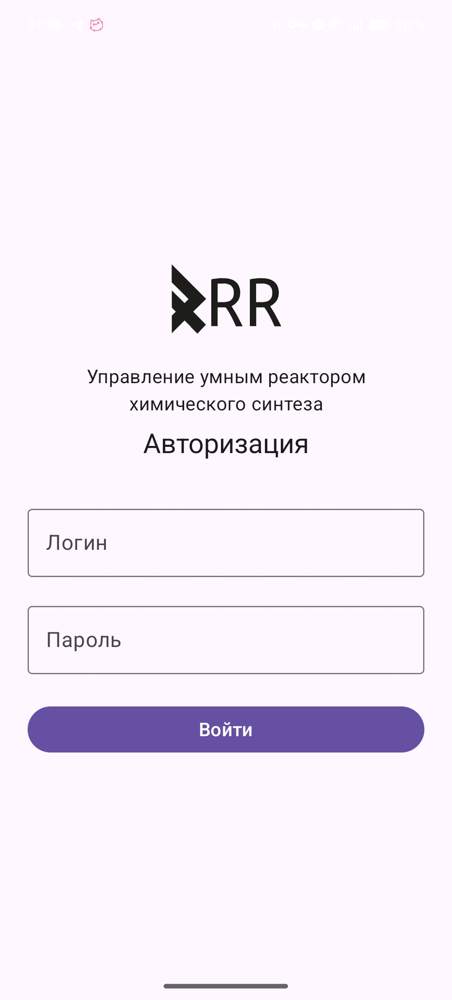
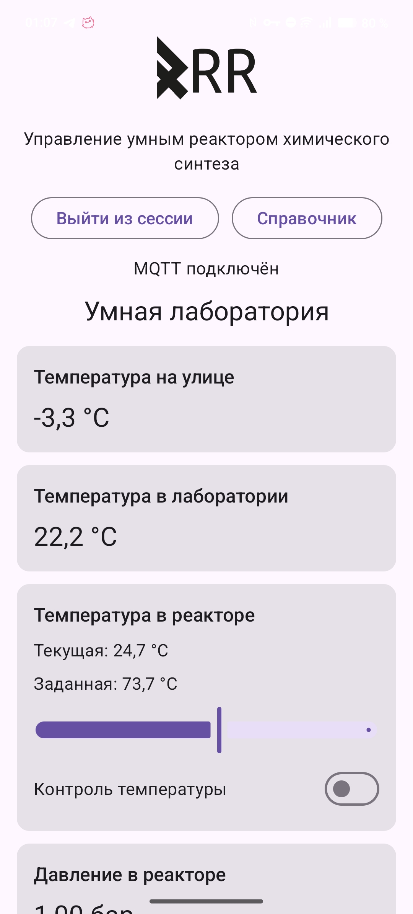
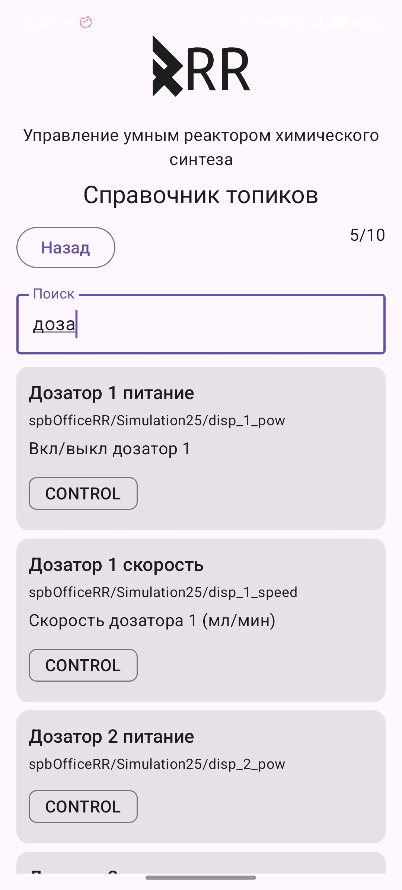

# RR Mobile Chem Studio

 

------------------------------------------------------------------------

**RR Mobile Chem Studio** is a research-grade mobile control interface
for intelligent chemical synthesis systems.

The application is currently used for experimental and R&D purposes by
engineering teams at **RR Robotics** and **ООО «Микрофлюидика»** to test
distributed laboratory automation workflows and real-time synthesis
control scenarios.

------------------------------------------------------------------------

## Table of Contents

-   [Overview](#overview)
-   [System Architecture](#system-architecture)
-   [Application Architecture](#application-architecture)
-   [Core Features](#core-features)
-   [Tech Stack](#tech-stack)
-   [Project Structure](#project-structure)
-   [N-Gram Topic Search](#n-gram-topic-search)
-   [Accessibility](#accessibility)
-   [Getting Started](#getting-started)
-   [Screenshots](#screenshots)
-   [Roadmap](#roadmap)

------------------------------------------------------------------------

## Overview

RR Mobile Chem Studio is part of a distributed cyber-physical laboratory
system designed for:

-   Remote synthesis control
-   Real-time telemetry monitoring
-   Dosing module management
-   Reactor temperature control
-   Experimental automation scenarios

The mobile client communicates with backend infrastructure via **HTTPS
(REST API)** and **MQTT (TCP)**.

------------------------------------------------------------------------

## System Architecture

The system consists of:

-   Android mobile client
-   HTTP backend server (Go)
-   NGINX reverse proxy (HTTPS)
-   MQTT broker
-   Laboratory devices (sensors and actuators)

Data exchange is divided into two channels:

-   **REST API (HTTPS)** --- authentication and configuration
-   **MQTT (TCP)** --- real-time telemetry and control commands

------------------------------------------------------------------------

## Application Architecture

The mobile application follows the **MVVM (Model--View--ViewModel)**
pattern.

### Layers

**View** - Jetpack Compose UI - User interaction handling

**ViewModel** - UI state management - Business logic - MQTT event
handling

**Model / Data Layer** - Repository - Retrofit API client - MQTT Manager
(Paho) - Room (local storage)

------------------------------------------------------------------------

## Core Features

-   Secure token-based authentication
-   Dynamic MQTT configuration loading
-   Real-time temperature monitoring
-   Pressure monitoring
-   Doser control (power & speed)
-   Reactor temperature control
-   Automatic MQTT session management
-   Error handling and connection recovery

------------------------------------------------------------------------

## Tech Stack

-   Kotlin
-   Jetpack Compose
-   MVVM Architecture
-   Retrofit + OkHttp
-   Eclipse Paho MQTT
-   Kotlin Coroutines + Flow
-   Room (SQLite)

------------------------------------------------------------------------

## Project Structure

    smart_labs/
    ├── auth/               # Authentication layer
    ├── login/              # Login UI & ViewModel
    ├── main/               # Main control screen
    ├── network/            # REST API client
    ├── mqtt/               # MQTT manager and topics
    ├── domain/             # Domain models
    ├── ui/                 # Compose UI components
    └── AppDatabase.kt      # Room database configuration

------------------------------------------------------------------------

## N-Gram Topic Search

The application includes an experimental n-gram based search mechanism within its domain layer.

The search algorithm:

- Splits strings into n-grams
- Computes overlap between query and indexed topics
- Ranks results based on similarity score
- Supports fuzzy matching without full-text indexing

This approach allows efficient approximate matching of MQTT topics, device identifiers, and domain entities without requiring external search engines.

The algorithm is implemented entirely on-device and is suitable for lightweight embedded laboratory environments.

------------------------------------------------------------------------

## Accessibility

RR Mobile Chem Studio is designed with consideration for basic accessibility principles.

The application leverages Jetpack Compose and Material components, which provide:

- System font scaling support
- Compatibility with Android accessibility services (TalkBack)
- Structured UI hierarchy
- Consistent contrast via centralized theme management

While advanced semantic annotations are not fully implemented in the current research prototype, the UI architecture allows future integration of enhanced accessibility features such as:

- Custom semantic labels
- Screen reader optimization
- High-contrast themes
- Adaptive typography

------------------------------------------------------------------------

## Getting Started

### Requirements

-   Android Studio Hedgehog or newer
-   Kotlin 1.9+
-   Gradle 8+
-   Min SDK 24+
-   Backend server with REST and MQTT endpoints

------------------------------------------------------------------------

## Screenshots

  
  
  

  <em>Login • Telemetry Dashboard • Control Panel</em>

------------------------------------------------------------------------

## Roadmap

-   Historical telemetry charts
-   Multi-reactor support
-   Advanced synthesis scenario configuration
-   Digital twin integration
-   Role-based access control

------------------------------------------------------------------------

## Status

This project is an active research prototype used in laboratory
automation R&D environments.
